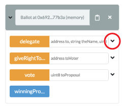
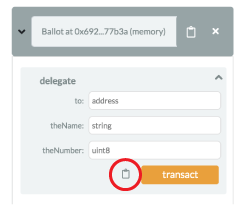
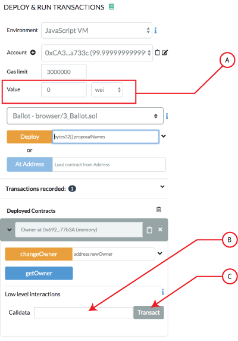

Run & Deploy (part 2)
=====================

## Deployed contracts

This section in the Run tab contains a list of deployed contracts to interact with through autogenerated UI of the deployed contract (also called udapp).

The deployed contract appears but is in its collapsed form.


Click the sideways caret to open it up.


You will see the functions in the contract.  The functions buttons can have different color buttons.

-   Functions that are `constant` or `pure` functions in Solidity have a blue buttons. Clicking one of this type does not create a new transaction. So clicking will not cause state changes - it will only return a value stored in the contract - so it won't cost you anything in gas fees.

-   Functions that change the state of the contract AND that do not accept Ether are called `non-payable` functions and have an orange button. Clicking on them will create a transaction and thus cost gas.

-   Functions that have red buttons are `payable` functions in Solidity. Clicking one of these will create a new transaction and this transaction can accept a **value**.  The **value** is put in in the Value field which is under the Gas Limit field.


See more information about [Solidity
modifiers](https://solidity.readthedocs.io/en/develop/miscellaneous.html?highlight=pure#modifiers) in the Solidity docs.
.

If a function requires input parameters, well.. you gotta put them in.

## Inputting parameters



### Inputting parameters in the collapsed view

(Inputting all the parameters in a single input box)
+ The input box tells you what type each parameter needs to be.
+ Numbers and addresses do not need to be wrapped in double quotes.  
+ Strings need to be wrapped.
+ Parameters are separated by commas.

In the example above the "delegate" function has 3 parameters.

### Inputting parameters in the expanded view
Clicking the 'down' caret brings you to the *Multi-param Manager* - where you can input the parameters one at a time. **Much less confusing!**



In the expanded view, strings do not need to be wrapped.  

Clicking the clipboard icon will encode the inputs and will copy them.  Only a valid set of inputs can be encoded.  

So if you made a mistake and put a uint8 where an address should have been, clicking the clipboard here will give you an error.

## Low level interactions

Low level interactions are used to send funds or calldata or funds & calldata to a contract through the **receive()** or **fallback()** function.  Typically, you should only need to implement the fallback function if you are following an upgrade or proxy pattern.

The low level interactions section is below the functions in each deployed contract.


Please note the following:

- If you are executing a plain Ether transfer to a contract, you need to have the receive() function in your contract.  If your contract has been deployed and you want to send it funds, you would input the amount of Ether or Wei etc. (see **A** in graphic below), and then input **NOTHING** in the calldata field of **Low level interactions** (see **B** in graphic) and click the Transact button (see **C** in graphic below).



- If you are sending calldata to your contract with Ether, then you need to use the fallback() function and have it with the state mutability of **payable**.  

- If you are not sending ether to the contract but **are** sending call data then you need to use the fallback() function.

- If you break the rules when using the **Low level interactions** you will be slapped with a warning.

Please see the [solidity docs](https://solidity.readthedocs.io/en/latest/contracts.html#receive-ether-function) for more specifics about using the **fallback** and **receive** functions. 

### Passing in a tuple or a struct to a function
To pass a tuple in, you need to put in an array [].

Similarly, to pass in a struct as a parameter of a function, it needs to be put in as an array [].  Also note that the line
`pragma experimental ABIEncoderV2;`
needs to put in at the top of the solidity file.

### Example of passing nested struct to a function
Consider a nested struct defined like this:
```
struct gardenPlot {
    uint slugCount;  
    uint wormCount;
    Flower[] theFlowers;
}
struct Flower {
    uint flowerNum;
    string color;
}
```
If a function has the signature `fertilizer(Garden memory gardenPlot)` then the correct syntax is:
```
[1,2,[[3,"Petunia"]]]
```

To continue on this example, here's a sample contract:

```
pragma solidity >=0.4.22 <0.7.0;
pragma experimental ABIEncoderV2;

contract Sunshine {
    struct Garden {
      uint slugCount;  
      uint wormCount;
      Flower[] theFlowers;
    }
    struct Flower {
        uint flowerNum;
        string color;
    }
      
    function picker(Garden memory gardenPlot) public {
        uint a = gardenPlot.slugCount;
        uint b = gardenPlot.wormCount;
        Flower[] memory cFlowers = gardenPlot.theFlowers;
        uint d = gardenPlot.theFlowers[0].flowerNum;
        string memory e = gardenPlot.theFlowers[0].color;
    }
}
```

After compiling, deploying the contract and opening up the deployed instance, we can then add the following input parameters to the function named **fertilizer** :

```
[1,2,[[3,"Black-eyed Susan"],[4,"Pansy"]]]
```

The function **fertilizer** accepts a single parameter of the type **Garden**. The type **Garden** is a **struct**. Structs are wrapped in **square brackets**.  Inside **Garden** is an array that is an array of structs named **theFlowers**. It gets a set of brackets for the array and another set for the struct. Thus the double square brackets.
